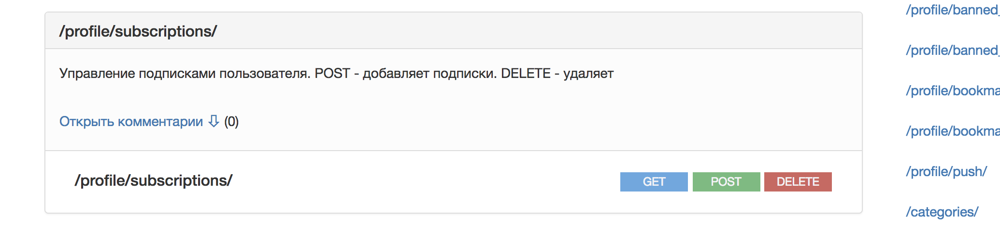
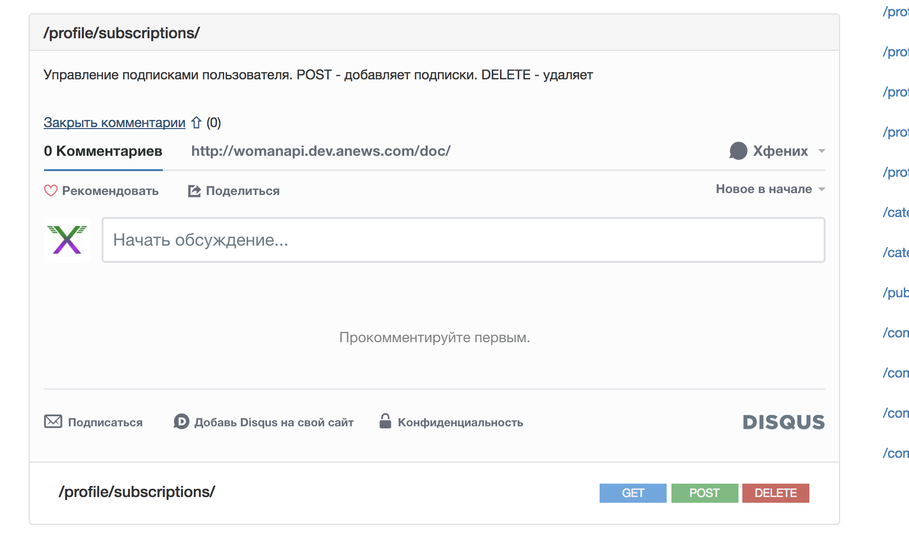

# raml2html disqus comments template
This template allows you to add comments for you methods in raml
This is not theme (i am sucks at nodejs packaging, so), this is template directory and first of all just a fork from raml2html-default-theme with some additions

Screenshots:
* Closed comment section 
* Opened comment section 

## Installation
1. Clone this repo
1. Register new disqus comments instance for your domain
1. Open index.nunjucks and replace ``YOUR_DISQUS_DOMAIN`` with your disqus domain (you get it while diqsus registration)
1. Use it like this ``raml2html --template raml2html-comments-template/index.nunjucks api.raml > index.html``
