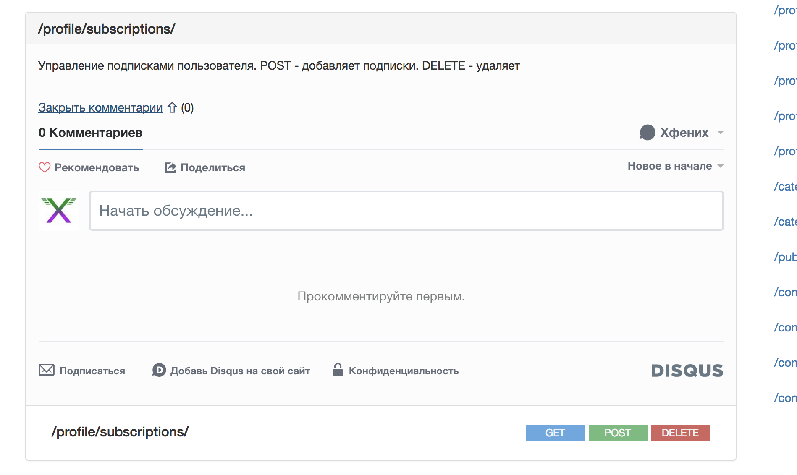

# raml2html disqus comments template
This template allows you to add comments for you methods in raml
This is not theme (i am sucks at nodejs packaging, so), this is template directory and first of all just a fork from raml2html-default-theme with some additions. So you can use it like template  
Replace language strings with you language if you doesnt know/like/use Russian language: [row 252](https://github.com/xfenix/raml2html-comment-template/blob/master/index.nunjucks#L252), [row 302](https://github.com/xfenix/raml2html-comment-template/blob/master/index.nunjucks#L302), [row 325](https://github.com/xfenix/raml2html-comment-template/blob/master/index.nunjucks#L325) in `index.nunjucks`
**WARNING!** All comments binded to unique resource id (that generates from your resource url). So you comments will be available while you dont change the resource id. This is only way to bind dynamic comments to static html. I hope this is will be helpful for someone

Screenshots:
* Closed comment section 
* Opened comment section 

## Installation
1. Clone this repo
1. Register new disqus comments instance for your domain
1. Open index.nunjucks and replace ``YOUR_DISQUS_DOMAIN`` with your disqus domain (you get it while diqsus registration)
1. Generate documentation from raml like this ``raml2html --template raml2html-comments-template/index.nunjucks api.raml > index.html``
1. Use you new shiny documenation with comments
1. ???
1. Profit
